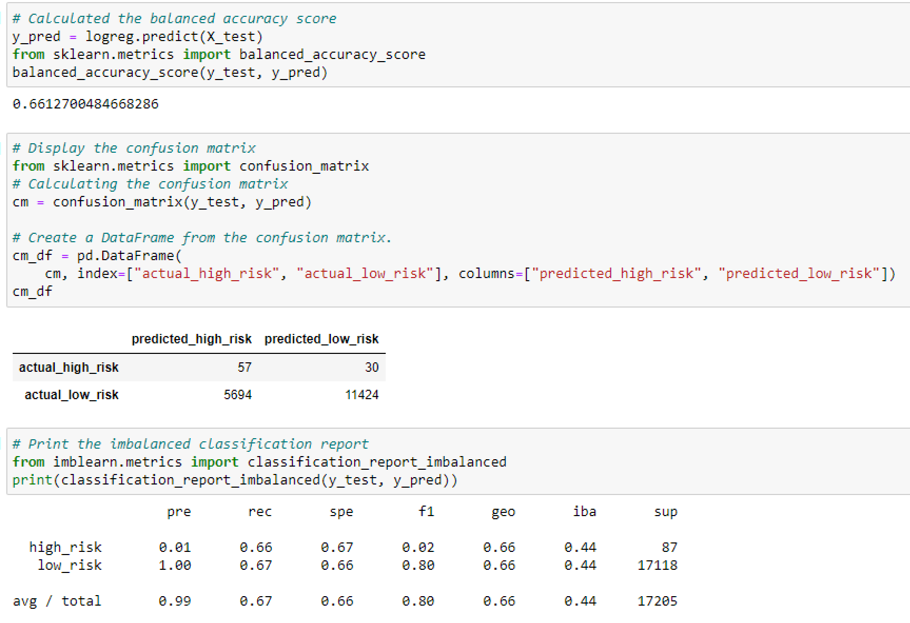
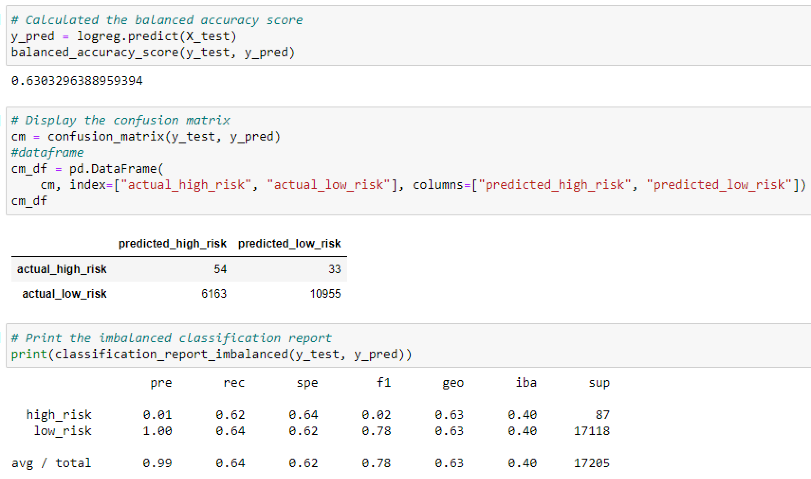
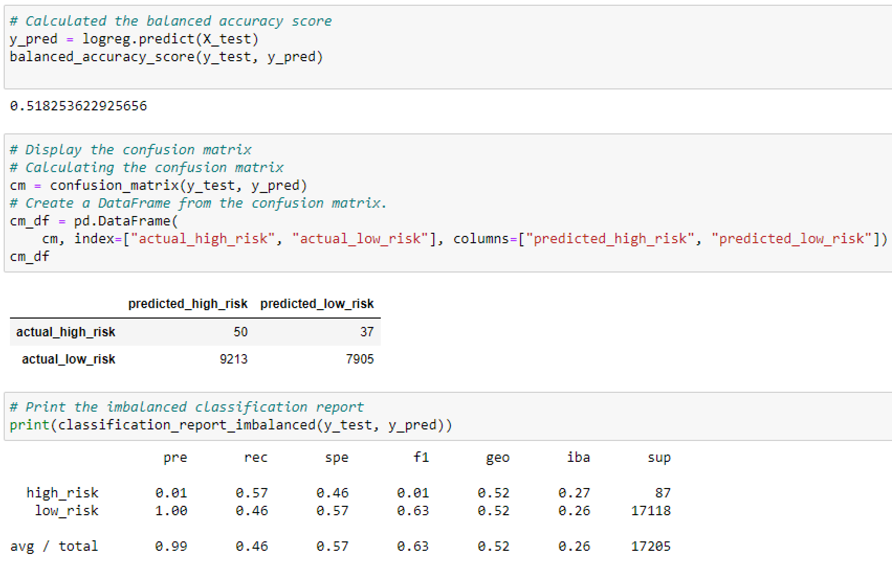
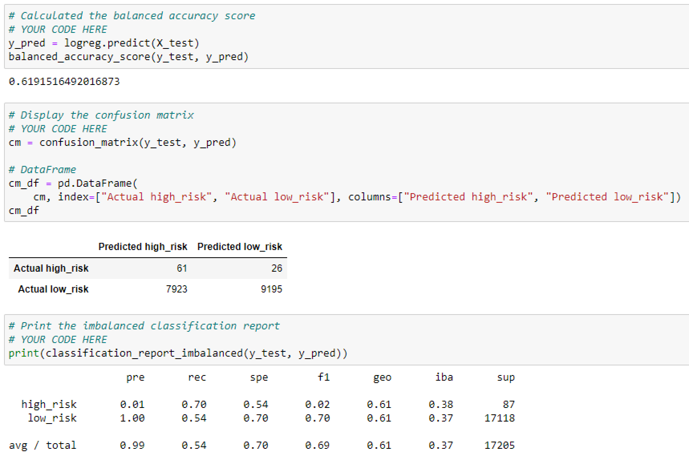
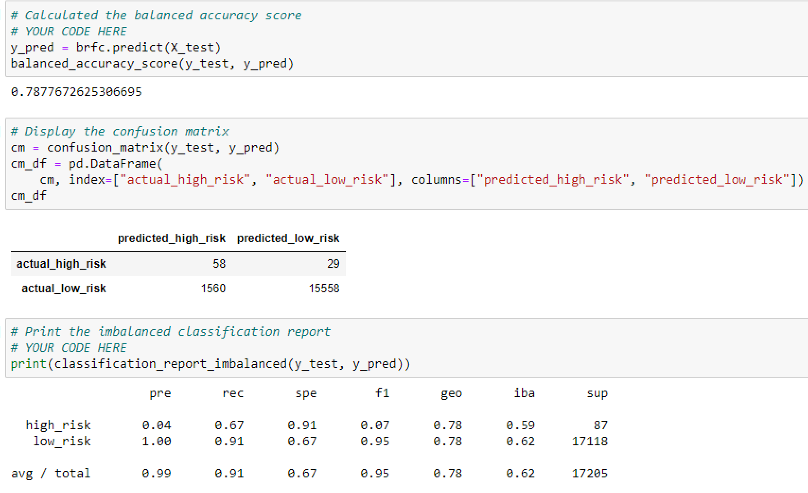
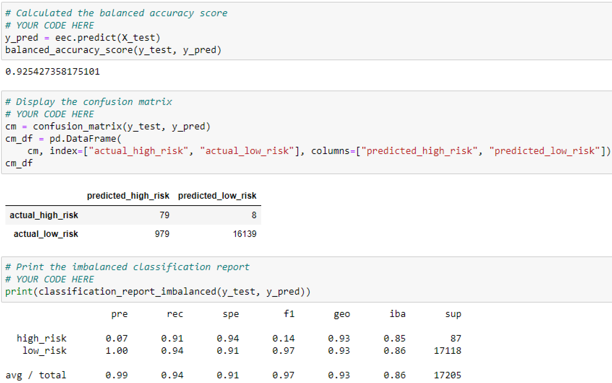

# Credit_Risk_Analysis
## Overview of the analysis: Explain the purpose of this analysis.
The purpose of this project is to analyze credit card risk. By using data, statistical reasoning, and machine learning to train the models, we are trying to predict credit risk. 
You are now ready to apply machine learning to solve a real-world challenge: credit card risk. Different techniques were used to train and evaluate the modles that have unbalanced classes. A data set from LendingClub, was provided to use the RandomOverSampler and SMOTE algorithms and ClusterCentroids. The machine learning models were compared.

## Results: Using bulleted lists, describe the balanced accuracy scores and the precision and recall scores of all six machine learning models. Use screenshots of your outputs to support your results.
* Naive Random Oversampling: 

Balance Accuracy Score: 66%

* SMOTE Oversampling

Balance Accuracy Score: 63%

* Cluster Centroids

Balance Accuracy Score: 52%

* SMOTEENN

* Balance Accuracy Score: 62%

* Balanced Random Forest Classifier

Balance Accuracy Score: 79%

* Easy Ensemble AdaBoost Classifier

Balance Accuracy Score: 93%

## Summary: Summarize the results of the machine learning models, and include a recommendation on the model to use, if any. If you do not recommend any of the models, justify your reasoning
